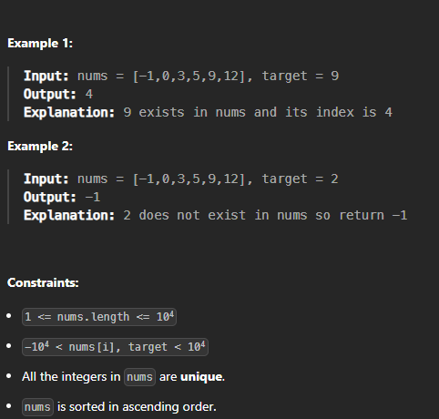

# '''Binary Search!'''

================================================================

Given nums array, sorted in asc order, find the integer target.

If target exists, return the index. Otherwise, return -1.

