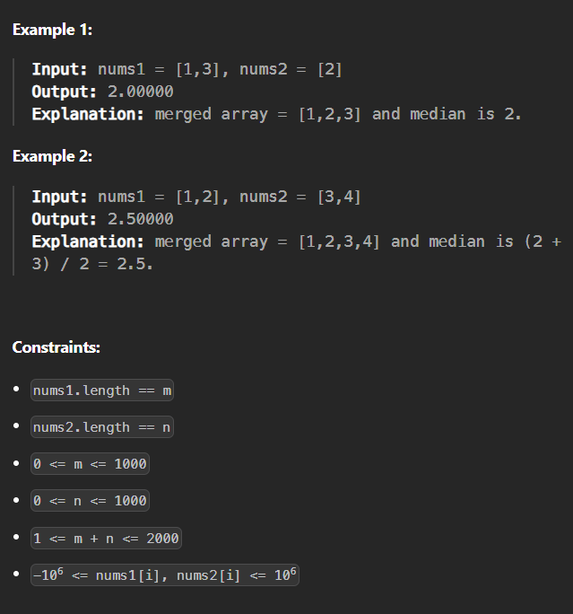

# '''Find the Median of the Sorted Arrays!'''

Your input: 2 number arrays
Your output: the median of the two arrays

Given the two sorted arrays of varied sizes, return the median of the two combined arrays.

